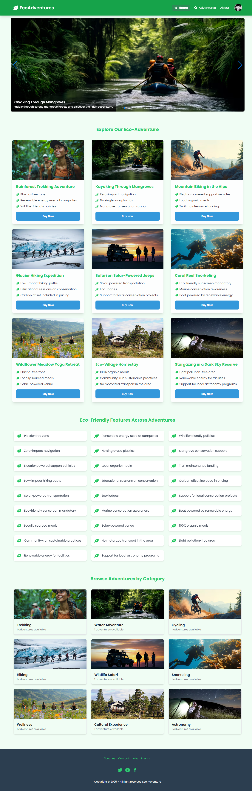
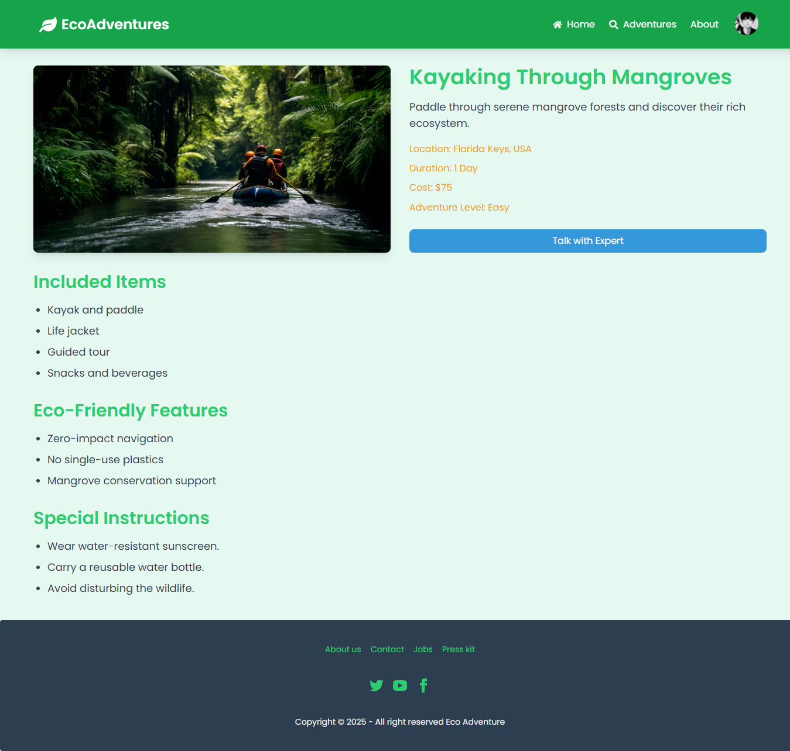
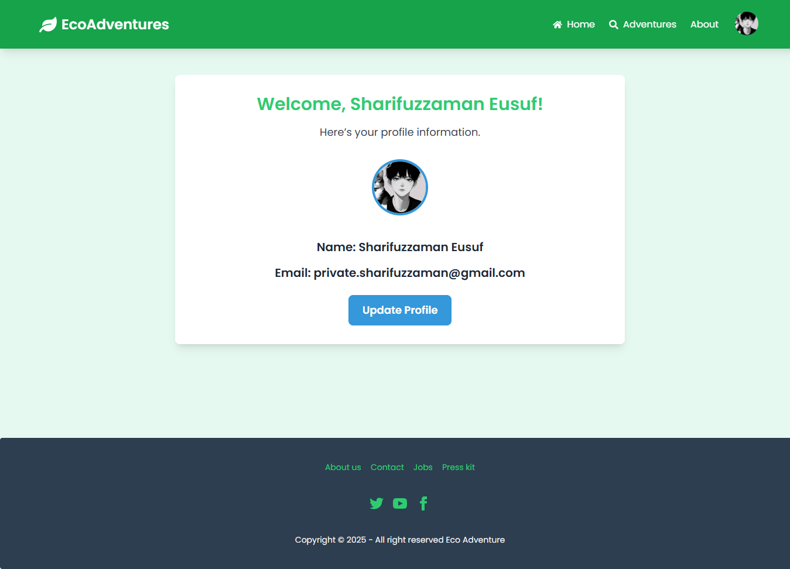
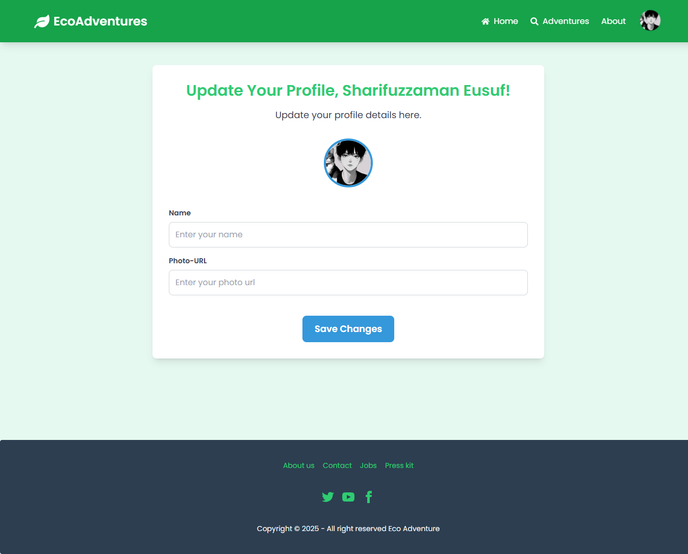
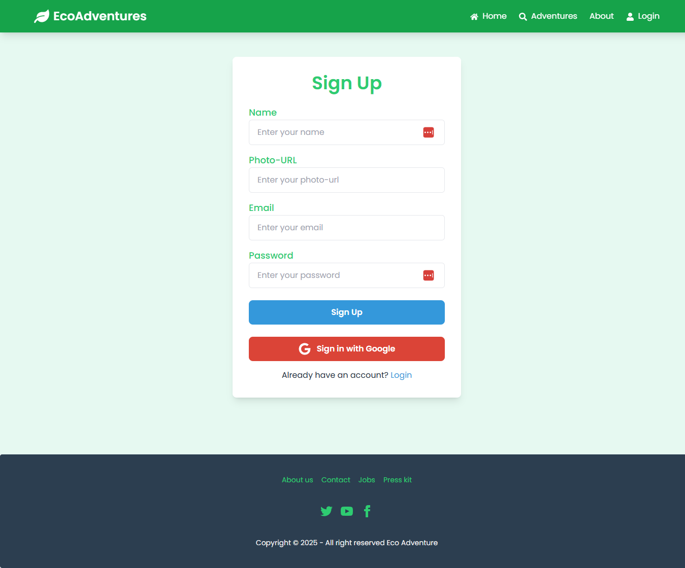
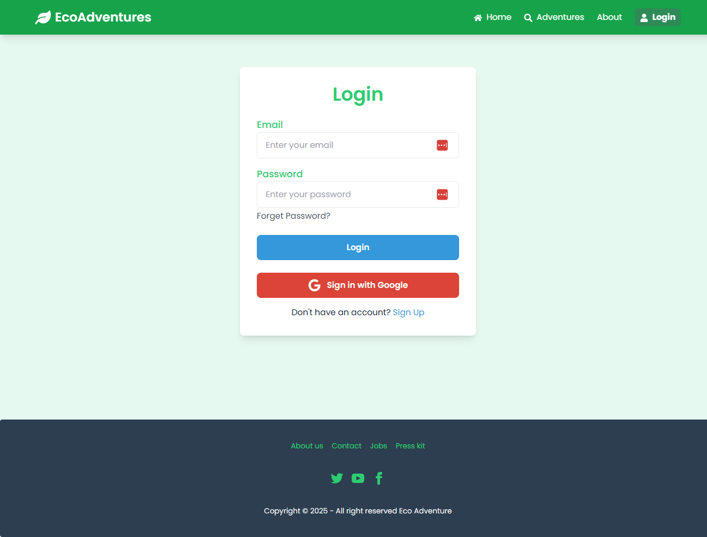

# Eco-Adventures

Welcome to the **Eco-Adventures**! This is a dynamic and responsive web application showcasing eco-friendly travel adventures such as mountain treks, ocean dives, wildlife safaris, and more. This project is designed to provide users with detailed information about various eco-adventures, engage them through user profiles and expert consultation, and ensure a smooth and responsive browsing experience.

## Purpose
This project aims to:
- Inspire users to explore eco-friendly travel adventures.
- Provide a platform for users to browse, learn, and consult experts about eco-adventures.
- Enhance user engagement through user profiles and secure login/registration features.

## Live URL
[View the live application here](https://assignment-nine-78034.web.app/)

## Key Features
### Core Features:
- **Dynamic Home Page:**
  - Interactive banner slider showcasing eco-adventure highlights.
  - Cards dynamically generated from JSON data to display adventure options.
  - "Explore Now" buttons that redirect users to detailed adventure pages.

- **Authentication System:**
  - Login, registration, and Google social login.
  - Secure user authentication with Firebase.
  - Password validation (uppercase, lowercase, minimum 6 characters).
  - Forgot password functionality with redirection to Gmail.

- **Private Routes:**
  - Adventure Details page displaying comprehensive adventure information.
  - My Profile page showing user information with an option to update.

- **Consultation Feature:**
  - "Talk with Expert" button opens Google Meet during consultation hours (10:00 AM - 8:00 PM) or shows consultation timings via a modal.

- **404 Error Page:**
  - Custom-designed Not Found page with navigation back to the home route.

- **Profile Management:**
  - Users can update their profile picture and name directly through Firebase.

### Additional Features:
- **Responsive Design:**
  - Fully responsive on mobile, tablet, and desktop.

- **Dynamic Titles:**
  - Implemented dynamic titles using the `useLocation` hook.

- **Extra Sections:**
  - Two additional sections on the homepage for enhanced user engagement.

- **Animations:**
  - Integrated `AOS` package for smooth scrolling animations.

## Screenshots
### Home Page


### Adventure Details Page


### User Profile Page


### User Profile Update Page


### Registration Page


### Login Page


## JSON Data
Sample data for eco-adventures includes the following fields:
- **Adventure Title**
- **Image**
- **ID**
- **Category Name**
- **Short Description**
- **Adventure Cost**
- **Booking Availability**
- **Location**
- **Duration**
- **Adventure Level**
- **Included Items** (Array)
- **Eco-Friendly Features** (Array)
- **Max Group Size**
- **Special Instructions** (Array)

## Technologies Used
- **Frontend:** React, Tailwind CSS, DaisyUI, AOS
- **Backend/Hosting:** Firebase Authentication, Firebase Hosting
- **Deployment:** Firebase Hosting
- **State Management:** React Context API

## Environment Variables
To secure sensitive data, Firebase configuration keys are stored using environment variables. Ensure to set these keys in a `.env` file.

## Installation & Setup
1. Clone the repository:
   ```bash
   git clone <repository-url>
   ```
2. Navigate to the project directory:
   ```bash
   cd eco-adventure-blog
   ```
3. Install dependencies:
   ```bash
   npm install
   ```
4. Set up environment variables:
   - Create a `.env` file and add your Firebase keys:
     ```env
     REACT_APP_API_KEY=your_api_key
     REACT_APP_AUTH_DOMAIN=your_auth_domain
     REACT_APP_PROJECT_ID=your_project_id
     REACT_APP_STORAGE_BUCKET=your_storage_bucket
     REACT_APP_MESSAGING_SENDER_ID=your_messaging_sender_id
     REACT_APP_APP_ID=your_app_id
     ```
5. Run the development server:
   ```bash
   npm start
   ```

## Future Enhancements
- Implement email verification for enhanced security.
- Add more eco-adventure categories and user engagement features.

## Author
Sharifuzzaman Eusuf  
[Portfolio](https://sharifuzzaman.vercel.app/) | [Linkedin Profile](https://www.linkedin.com/in/sharifuzzaman24/)

---
Thank you for exploring the **Eco-Adventures**. Let the journey to eco-friendly adventures begin!

